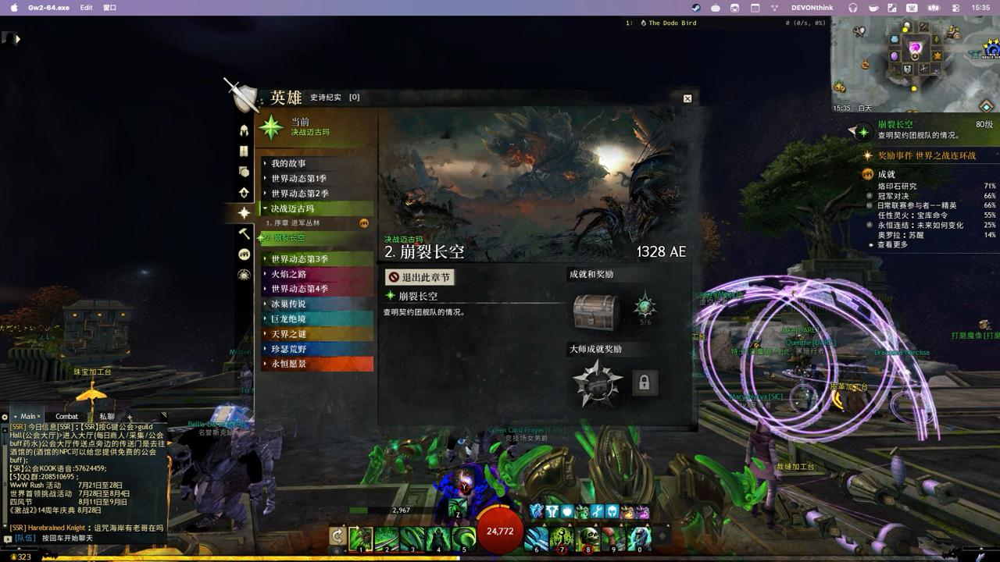
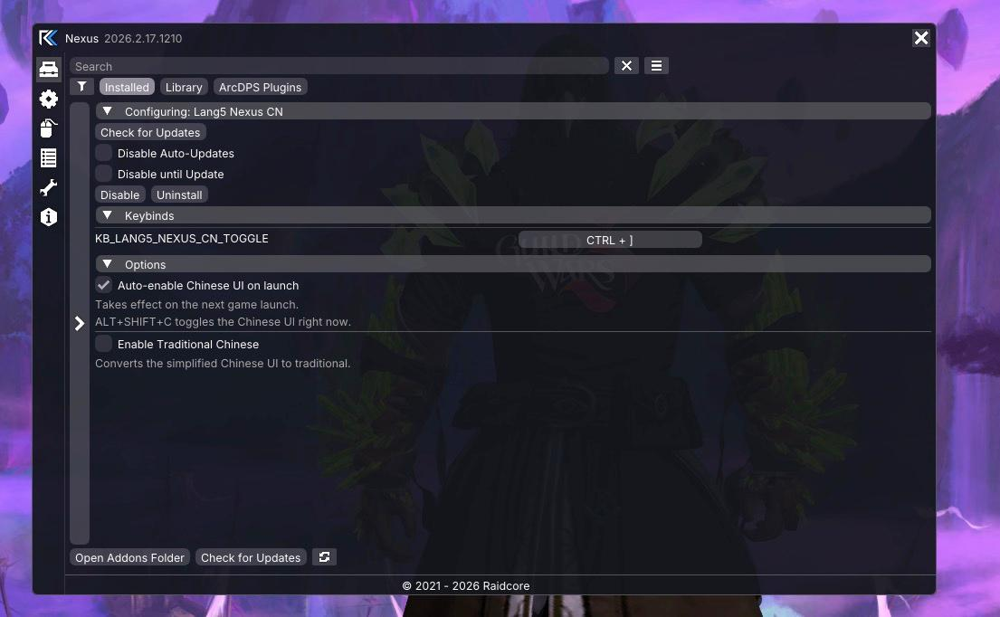

> 当前发布版本：**v0.3.1**。已适配并测试 2026 年 7 月的游戏版本；后续大型游戏更新仍可能需要重新适配。
>
> Current release: **v0.3.1**. Tested against the July 2026 game build; future major game updates may still require compatibility updates.

# Lang5 Nexus CN —《激战2》简体 / 繁体中文界面

一个 [Nexus](https://raidcore.gg/Nexus) 插件，让《激战2》显示**简体中文**界面，并可一键将界面文字实时转换为**繁体中文**。

A [Nexus](https://raidcore.gg/Nexus) addon that enables the **Simplified Chinese** interface in Guild Wars 2 and can convert the UI text to **Traditional Chinese** in real time.

> 灵感与技术来自 [cy-sp-howard/lang5](https://github.com/cy-sp-howard/lang5)。
> Inspired by and based on techniques from [cy-sp-howard/lang5](https://github.com/cy-sp-howard/lang5).

---

## 截图 Screenshots

### 游戏内中文界面 Chinese UI In Game



### Nexus 插件设置 Nexus Addon Options



---

## ⚠️ 请先读这里 Please Read This First

* 这是一个**非官方、实验性**工具，会**读取和修改游戏内存**。

* This is an **unofficial, experimental** tool that **reads and modifies game memory**. 

* 插件不会自动操作游戏、影响战斗结果或向玩家提供竞争优势。

* The addon does not automate gameplay, affect combat outcomes, or provide a competitive advantage.

* 游戏每次大版本更新后，插件都可能**失效甚至导致游戏崩溃**。游戏更新后建议先停用插件，等待适配版本。

* After a major game update, the addon may **stop working or crash the game**. Disable it after game updates and wait for a compatible version.

* 如果游戏闪退或异常，**第一步应删除或停用本插件**：关闭游戏，从 `addons` 文件夹中删除 `Lang5NexusCn.dll`，再重新启动。

* If the game crashes or misbehaves, **remove this addon first**: close the game, delete `Lang5NexusCn.dll` from the `addons` folder, and restart.

---

## 平台支持 Platform Support

插件是 **Windows x64 DLL**。Windows 可以直接运行；macOS 与 Linux 需要通过 CrossOver、Wine 或其他 Windows 兼容层运行《激战2》，并不提供原生 macOS/Linux 构建。

The addon is a **Windows x64 DLL**. It runs directly on Windows; macOS and Linux require Guild Wars 2 to run through CrossOver, Wine, or another Windows compatibility layer. Native macOS/Linux builds are not provided.

---

## 安装 Installation

只需要一个文件。插件所需的简繁转换字典已内置在 DLL 中。

Only one file is needed. The Chinese conversion dictionary is built into the DLL.

1. 安装好 [Nexus](https://raidcore.gg/Nexus) 插件框架。
2. 将 `dist` 文件夹中的 `Lang5NexusCn.dll` 复制到游戏目录的 `addons` 文件夹，例如：

1. Install the [Nexus](https://raidcore.gg/Nexus) addon framework.
2. Copy `Lang5NexusCn.dll` from the `dist` folder into the game's `addons` folder, for example:

```text
D:\Guild Wars 2\addons\Lang5NexusCn.dll
```

3. 启动游戏，打开 Nexus 菜单（默认 `Ctrl + O`），在插件列表中找到 **Lang5 Nexus CN** 并**启用（Enable）**。

3. Launch the game, open the Nexus menu (default `Ctrl + O`), find **Lang5 Nexus CN** in the addon list and **Enable** it.

---

## 使用 Usage

### 切换简体中文 Toggle Simplified Chinese

在游戏中按 `ALT + SHIFT + C` 切换简体中文界面，再按一次切回原语言。快捷键可在 Nexus 按键设置中修改。

Press `ALT + SHIFT + C` in game to switch to Simplified Chinese; press again to switch back. The hotkey can be changed in the Nexus keybind settings.

如需**每次启动游戏自动启用中文**：打开 Nexus → **Lang5 Nexus CN** → **Options** → 勾选 `Auto-enable Chinese UI on launch`。

To **auto-enable Chinese on every launch**: open Nexus → **Lang5 Nexus CN** → **Options** → check `Auto-enable Chinese UI on launch`.

### 开启 / 关闭繁体中文 Enable / Disable Traditional Chinese

打开 Nexus → **Lang5 Nexus CN** → **Options** → 勾选 `Enable Traditional Chinese`。设置自动保存。

Open Nexus → **Lang5 Nexus CN** → **Options** → check `Enable Traditional Chinese`. The setting is saved automatically.

> 繁体转换在简体中文界面的基础上进行，请先用 `ALT + SHIFT + C` 切换到简体中文。
> Nexus 自带字体不含中文字符，因此设置面板为英文显示。
>
> Traditional conversion works on top of the Simplified Chinese UI — enable Simplified Chinese first with `ALT + SHIFT + C`.
> Nexus's built-in font has no Chinese glyphs, so the settings panel is in English.

---

## 遇到问题 Troubleshooting

* **界面没有变成中文**：确认插件已在 Nexus 中启用，并按过 `ALT + SHIFT + C`。如果游戏刚更新，插件可能暂时不兼容，请先停用。

* **The UI does not switch to Chinese**: make sure the addon is enabled in Nexus and you pressed `ALT + SHIFT + C`. If the game was just updated, the addon may be temporarily incompatible — disable it and wait.

* **繁体没有生效**：确认已先切换到简体中文，然后在设置中重新勾选 `Enable Traditional Chinese`。

* **Traditional Chinese is not working**: make sure the Simplified Chinese UI is enabled first, then re-check `Enable Traditional Chinese` in the options.

* **游戏闪退**：删除 `addons` 文件夹中的 `Lang5NexusCn.dll` 后重启游戏。若 Nexus 在游戏更新后自动停用了本插件，请保持停用，等待适配版本。

* **The game crashes**: delete `Lang5NexusCn.dll` from the `addons` folder and restart. If Nexus auto-disabled the addon after a game update, keep it disabled until an updated version is released.

---

## 致谢与许可 Credits & License

* 基于 [cy-sp-howard/lang5](https://github.com/cy-sp-howard/lang5) 的实验性 Nexus 移植。
* 内置简繁字典来自 [kfcd/fanjian](https://github.com/kfcd/fanjian)，采用 **CC BY 3.0** 授权。
* 开发过程中使用了 AI 辅助编程与文档工具；发布内容由维护者审查，合规与维护责任由维护者承担。
* 完整的第三方组件与许可说明见 [THIRD_PARTY_NOTICES.md](THIRD_PARTY_NOTICES.md)。

* An experimental Nexus port based on [cy-sp-howard/lang5](https://github.com/cy-sp-howard/lang5).
* The built-in dictionary is derived from [kfcd/fanjian](https://github.com/kfcd/fanjian), licensed under **CC BY 3.0**.
* AI-assisted coding and documentation tools were used during development. The maintainer reviews released material and remains responsible for compliance and maintenance.
* See [THIRD_PARTY_NOTICES.md](THIRD_PARTY_NOTICES.md) for complete third-party component and licensing notices.
